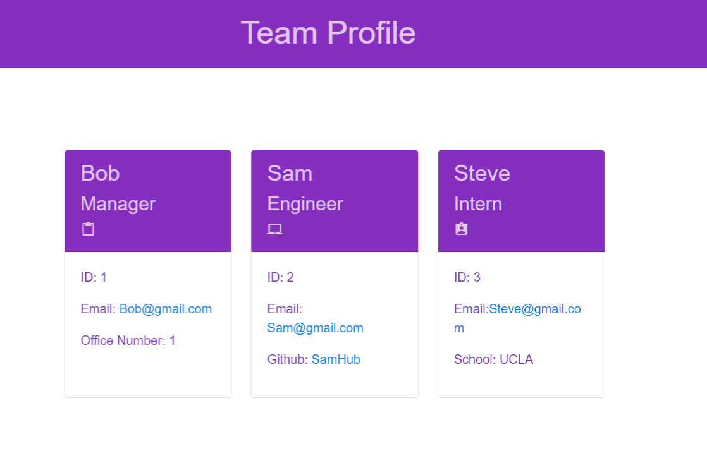

# Team Profile Generator 

## Description 
This application was created to generate a team profile based on user input using the Inquirer module from Node.js and displaying the information on a newly created html page with a style sheet. This project demonstrates use of OOP and TDD using Jest. 
 
## Table of Contents
* [Installation](#installation)
* [Usage](#usage)
* [License](#license)
* [Tests](#tests)
* [Questions](#questions)

## Installation 
The user should clone the repository from GitHub and download Node.
The application uses Inquirer and Jest (for testing)
Install Inquirer with "npm install --save inquirer" 

## Usage 
Type "node index" and respond to the prompts

[Walkthrough Video](https://drive.google.com/file/d/1d6BF9WjL32hkOAg1FaMOGWTXbiJ5eyVW/view?usp=sharing)

 

## License 
This project is license under MIT

## Tests
Run `npm run test` to run Jest 

## Questions
If you have any questions about this projects, please contact me directly at Hoverbad@gmail.com.